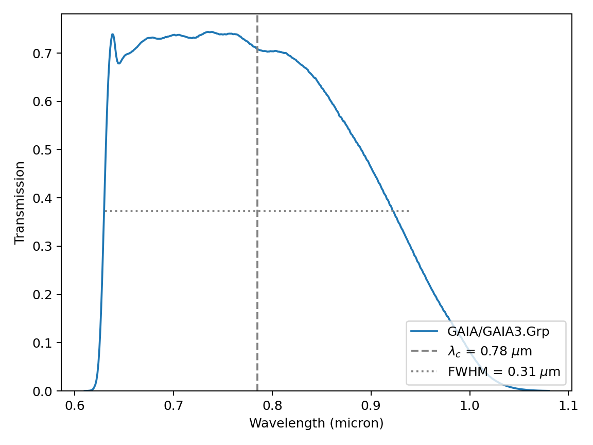
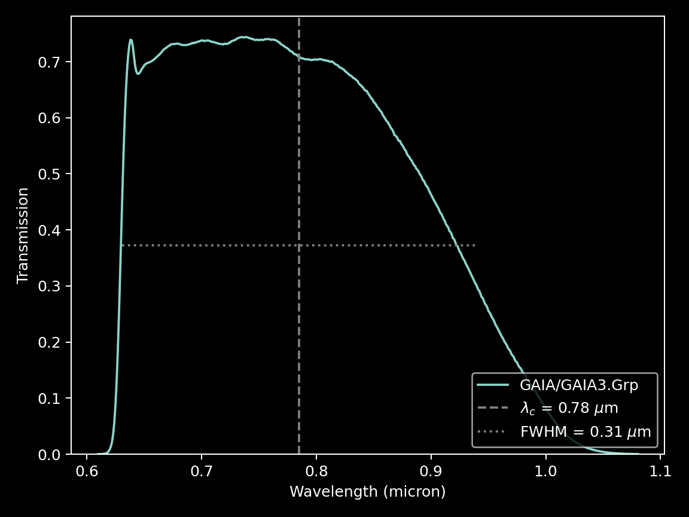

.. _filters:

#########
``Filter utilities``
#########

.. raw:: html

    

.. role:: gray

.. |br| raw:: html

      

.. highlight:: python

``ska`` offers a simple access to filter information, as provided by the 
`SVO Filter Profile Service <http://svo2.cab.inta-csic.es/svo/theory/fps3/index.php>`_.
The basic information can be displayed, the transmission curve plotted, and
filters can be searched for by name.

|br|

.. _filter_info: 

:octicon:`archive;1em` Filter Information
=========================================

The main characteristics of a filter, such as central wavelength, 
:term:`full width at half maximum (FWHM)<Full Width at Half Maximum (FWHM)>`, 
facility, instrument, and band, can be easily retrieved with ``ska``.

.. tab-set::

  .. tab-item:: Command Line

    The ``$ ska filter [filter]`` command prompts a simple summary of the requested filter.

      .. code-block:: bash

          $ ska filter Paranal/VISTA.Ks
          
          Filter ID : Paranal/VISTA.Ks
          Facility  : Paranal
          Instrument: VIRCAM
          Band      : Ks
          Central λ : 2.148 (micron)
          FWHM      : 0.306 (micron)

  .. tab-item :: python

    The ``Filter`` class offers a simple way to access the basic information of a filter.
    It also contains a ``VOFilter`` attribute, which is 
    `astropy.io.votable.tree.VOTableFile <http://docs.astropy.org/en/stable/api/astropy.io.votable.tree.VOTableFile.html>`_
    object, which contains all informations.

     .. code-block:: python

       >>> from ska import Filter                # Class for filters
       >>> VISTA_Ks = Filter("Paranal/VISTA.Ks") # Retrieve VISTA Ks filter
       >>> VISTA_Ks.facility                     # Access parameter via the dot notation
       'Paranal'
       >>> VISTA_Ks.instrument
       'VIRCAM'
       >>> VISTA_Ks.central_wavelength
       1.6458237
       >>> VISTA_Ks.FWHM
       0.289423
       >>> type(VISTA_Ks.VOFilter)
       astropy.io.votable.tree.VOTableFile

|br|

.. _filter_plot: 

:octicon:`graph;1em` Plotting transmission curves
=================================================

``ska`` can plot the transmission curve of a filter for quick visualization.

.. tab-set::

  .. tab-item:: Command Line

    The ``$ ska plot [filter]`` command will plot the requested transmission curve.
    Use the ``--black`` option to create a figure with a black background.
    Use the ``--figure [filename]`` option to save the figure to a file.

      .. code-block:: bash

          $ ska plot GAIA/GAIA3.Grp --black
         
  .. tab-item :: python

    The transmission curve is accessible with the ``wave`` and ``trans`` attributes of the 
    ``Filter`` object. The ``plot_transmission`` method of the ``Filter`` class can be used to
    create simple plots of the transmission curve.

     .. code-block:: python

       >>> from ska import Filter                 # Class for filters
       >>> VISTA_Ks = Filter("GAIA/GAIA3.Grp")    # Retrieve Gaia RP filter (DR3)
       >>> VISTA_Ks.plot_transmission(black=True) # Plot the transmission curve

 

|br|

.. _filter_search:

Searching among filters
============================================

